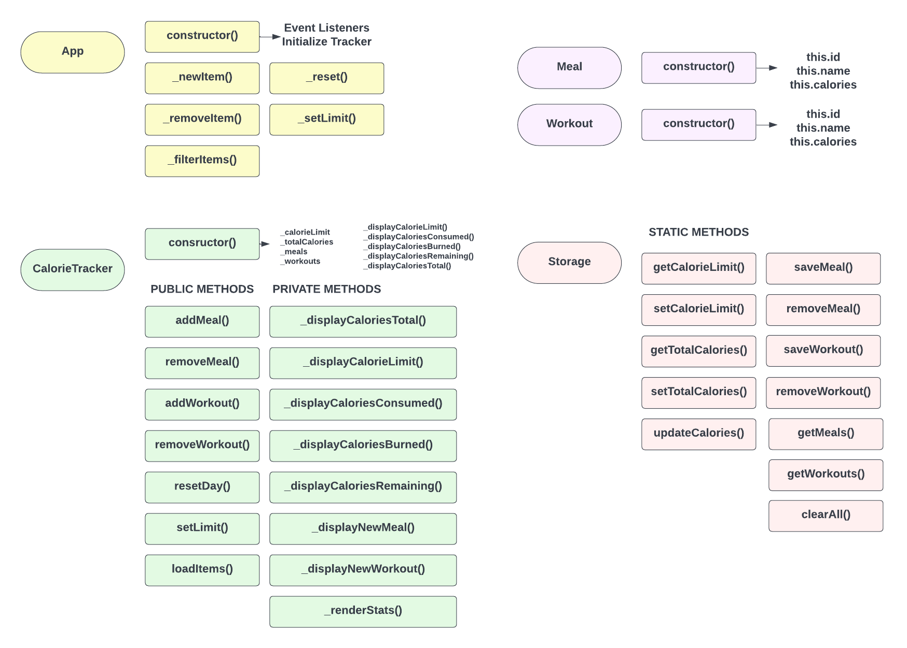

# Tracalorie

<p align="center">
  
  
  
  
  
  
</p>

<p align="center">
  <a href="https://tracalorie-mu.vercel.app/"><strong>Live Demo</strong></a>
  ·
  <a href="https://github.com/MostafaMohammedAtef/tracalorie/issues">Report an Issue</a>
</p>

<p align="center">
  A single-page calorie and wellness tracker built in vanilla JavaScript, structured around a small, explicit object model with a clean separation between UI, state, and persistence.
</p>

---

## Overview

Tracalorie is a client-side dashboard for logging daily nutrition and activity. A user sets a calorie budget, records meals and workouts against it, and the app derives consumption, burn, and remaining balance in real time. Hydration tracking and a short daily journal entry round out the picture. There is no backend: the entire application state is held in memory during a session and persisted to `localStorage` between visits.

The project is intentionally scoped as a **static, dependency-light front end**: no build step, no framework, no package manager. It still applies the separation-of-concerns discipline you'd expect from a larger codebase. That trade-off is the main point of interest here: how far a plain OOP structure can go before you'd actually reach for a framework.

## Table of Contents

- [Features](#features)
- [Architecture](#architecture)
- [Tech Stack](#tech-stack)
- [Styling & Theming](#styling--theming)
- [Project Structure](#project-structure)
- [Getting Started](#getting-started)
- [Usage](#usage)
- [Roadmap](#roadmap)

## Features

| Area | Capability |
|---|---|
| **Dashboard** | Real-time calorie limit, net gain/loss, consumed, burned, and remaining totals, with a progress bar tracking pace against the daily limit |
| **Meals** | Add, edit, delete, and filter meal entries (name + calories) |
| **Workouts** | Add, edit, delete, and filter workout entries (name + calories burned) |
| **Calorie limit** | Set or update the daily target from a modal; every derived metric recalculates immediately |
| **Hydration** | Log water intake in preset increments with its own progress bar toward a daily goal |
| **Journal** | Record an energy level and a short free-text note for the day |
| **Filtering** | Real-time text filtering across meals and workouts, independently |
| **Reset** | Clear the day's meals, workouts, water, and journal entry in one confirmed action |
| **Export** | Download the current day's full state as a JSON file |
| **Persistence** | All state survives a page refresh via `localStorage`, with no account or server required |

## Architecture

The app follows a **four-layer object model**, visualized below and implemented in `js/app.js`:



*(Class and method names below reflect the shipped implementation in `js/app.js`, which has grown a few responsibilities past this original design sketch: journaling, filtering, and export chief among them.)*

| Class | Role | Responsibility |
|---|---|---|
| **`App`** | Controller / event layer | Wires up every DOM event listener on construction (forms, filters, water buttons, export, journal) and owns per-item rendering: `_appendItem` / `_renderItems` build the meal and workout cards, and `_editItem` handles inline edits via prompts. Holds no tracked state itself; it delegates every mutation to `CalorieTracker`. |
| **`CalorieTracker`** | State layer | The single source of truth for the current day: calorie limit, the in-memory `_meals` / `_workouts` collections, water, and the journal entry. Totals are never stored; `_calculateTotal()` derives them from `_meals` and `_workouts` on every mutation. Exposes a public API (`addMeal`, `removeMeal`, `editMeal`, `addWorkout`, `removeWorkout`, `editWorkout`, `setCalorieLimit`, `addWater`, `saveJournal`, `clearItems`) and keeps the aggregate dashboard numbers (limit, totals, remaining, progress bars) behind private `_display*` methods. |
| **`Meal`** / **`Workout`** | Domain models | Minimal data classes (`id`, `name`, `calories`) representing a single tracked entry, with `id` defaulting to a random token if none is supplied. Kept deliberately dumb, no behavior, just shape. |
| **`AppStorage`** | Persistence layer | A static utility class wrapping `localStorage` behind a `keys` map, so every persisted value lives under a namespaced key. Provides get/set pairs for the calorie limit, meals, workouts, water, and journal, plus `clearItems()` (used by "Reset Day," which preserves your calorie limit) and a broader `clearAll()` that also drops it. This is the only module that talks to `localStorage` directly. |

State is persisted under five namespaced keys: `tracalorie-calorie-limit`, `tracalorie-meals`, `tracalorie-workouts`, `tracalorie-water`, `tracalorie-journal`. That keeps the app's data from colliding with anything else stored under the same origin.

**Why it's shaped this way:**

- **Single source of truth.** `CalorieTracker` is the only place derived numbers (consumed, burned, remaining, net) are computed, so the dashboard can never drift from the underlying data.
- **Persistence is isolated.** Nothing outside `AppStorage` reads or writes `localStorage` directly. Swapping local storage for a REST API or IndexedDB later is a change to one module, not a rewrite.
- **Encapsulation by convention, not enforcement.** Internal methods and fields use a leading-underscore convention (`_displayCaloriesTotal`, `_calculateTotal`, `_meals`) to signal "implementation detail." It's naming only, though. `App` reaches directly into `this._tracker._meals`, `_tracker._journal`, and `_tracker._calorieLimit` when rendering and exporting, rather than going through public getters. Worth tightening (see [Roadmap](#roadmap)).
- **Thin-ish controller.** `App` contains no calorie math, but it does own per-item DOM rendering and editing, a responsibility that arguably belongs closer to the state layer. The calorie math itself stays independently testable regardless.

## Tech Stack

- **HTML5**: semantic structure and layout
- **CSS3**: custom styling layered on top of Bootstrap primitives
- **JavaScript (ES6 classes, no framework)**: application logic, state, and rendering
- **Bootstrap 5.2.3** (CSS): grid, modal, and component primitives, compiled with an overridden brand palette. The vendored `bootstrap.bundle.min.js` is v5.0.2 (see [Roadmap](#roadmap))
- **Sass (SCSS)**: Bootstrap is vendored as full source under `scss/` and compiled locally rather than pulled from a CDN. The compiled output is committed, so no build step is required just to run the app
- **Font Awesome Free 6.2.1**: iconography
- **Web Storage API (`localStorage`)**: client-side persistence

## Styling & Theming

The visual design is layered rather than defined in one place:

1. **Bootstrap's own palette is pre-swapped, at the source.** `scss/` vendors the complete Bootstrap 5.2.3 Sass source (`forms/`, `helpers/`, `mixins/`, `utilities/`, `vendor/`, plus every standard partial), and the compiled `css/bootstrap.css` is built from it locally rather than linked from a CDN. Only a couple of those partials are actually customized for this project, almost certainly the color and theme variables, since that's the only thing that differs from stock Bootstrap in the compiled output (`--bs-primary` and `--bs-success` both resolve to a green, `--bs-secondary` to an orange). The rest of the ~50 vendored files are the untouched library, kept so the theme can be rebuilt.
2. **`style.css` layers a second, wider palette on top** through its own custom properties (`--ink`, `--paper`, `--surface`, `--tomato`, `--paprika`, `--gold`, `--aubergine`, `--ocean`, `--cyan`), then reassigns the elements that actually carry the app's look (`.btn-primary`, `.items .bg-primary`, the metric-card gradients) directly to these tokens with `!important`. In practice, this second layer defines Tracalorie's identity; Bootstrap's own compiled-in palette mostly goes unused once `style.css` loads after it.
3. **Responsive behavior is consolidated, not scattered.** Every mobile-specific rule lives in a single `@media (max-width: 575.98px)` block at the end of `style.css`, rather than spread across the file.

This works, but it's two theming layers doing one job. Reassigning Bootstrap's own `--bs-*` variables to the app's palette directly, instead of overriding a second token set with `!important`, would collapse them into one.

## Project Structure

```text
tracalorie/
├── index.html
├── project_diagram.png
├── css/
│   ├── bootstrap.css
│   ├── bootstrap-grid.css
│   ├── bootstrap-reboot.css
│   ├── bootstrap-utilities.css
│   ├── fontawesome.css
│   └── style.css
├── js/
│   ├── app.js                # App, CalorieTracker, Meal, Workout, AppStorage
│   └── bootstrap.bundle.min.js
├── scss/                      # Full vendored Bootstrap 5.2.3 source; only a couple of partials are actually customized
│   ├── forms/ · helpers/ · mixins/ · utilities/ · vendor/
│   ├── bootstrap.scss · bootstrap-grid.scss · bootstrap-reboot.scss · bootstrap-utilities.scss
│   ├── _variables.scss · _root.scss · ... (~40 more stock Bootstrap partials)
│   └── style.scss
├── webfonts/
├── favicon.ico
└── README.md
```

## Getting Started

### Prerequisites

Nothing to install. This is a static site with zero build tooling and no package manager dependency. You need a modern browser and, optionally, a local static file server.

### Run locally

```bash
git clone https://github.com/MostafaMohammedAtef/tracalorie.git
cd tracalorie
python -m http.server
```

Then open `http://localhost:8000` in your browser. Alternatively, open `index.html` directly, since the app has no server-side requirements.

## Usage

1. Set a daily calorie limit from the header.
2. Log meals as you eat, with a name and calorie count.
3. Log workouts as you complete them, with a name and calories burned.
4. Track hydration using the quick-add water buttons.
5. Leave a short journal note on how the day felt.
6. Use the filter fields to find a specific meal or workout instantly.
7. Export the day as JSON if you want to keep a record outside the browser, or reset to start clean.

## Roadmap

Ideas for pushing this past a learning project, roughly in order of impact:

- [ ] Convert `_`-prefixed conventions to true private class fields (`#method`), and stop `App` from reaching into `CalorieTracker`'s internals directly
- [ ] Align Bootstrap versions: CSS is compiled at v5.2.3, but the vendored `bootstrap.bundle.min.js` is v5.0.2
- [ ] Collapse the two color-token layers (framework `--bs-*` vars vs. `style.css`'s own palette) into one theming source
- [ ] Add a unit test suite (Jest) around `CalorieTracker`'s calorie math
- [ ] Replace `localStorage` with a small backend (or IndexedDB) for multi-device sync
- [ ] Document the Sass command used to (re)compile `css/bootstrap.css` from `scss/`, and prune the vendored partials that aren't actually part of that build
- [ ] Add a dark theme toggle

---

<p align="center">
  Built by <a href="https://github.com/MostafaMohammedAtef">Mostafa Mohamed Atef</a>
</p>
